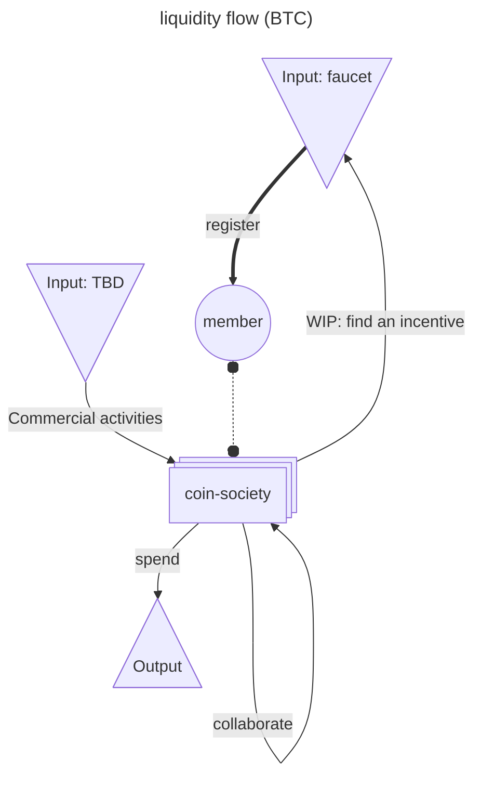

# [coin-society.eth](https://coin-society.org) - Contributor documentation

[Home](./README.md) | [Source code](./website/) | [**Contributor documentation**](./CONTRIBUTING.md)

## Thank you

First of all, if you have registered with [coin-society.eth](https://app.ens.domains/coin-society.eth), congratulation for your first contribution 🥳

Thank you for taking the time to contribute for the broader adoption of [open source software](https://en.wikipedia.org/wiki/Open_source) and [peer to peer](https://en.wikipedia.org/wiki/Peer-to-peer) network for a better common world ❤️

> And whatever you do, do it heartily, as to the Lord and not to men ~ Colossians 3:23

## (WIP) Documentation

### Use case example

> We just split a bill using bitcoin, the future is here - bc1q8em0mdcer84fy724awvvy9yegcart4r7gxf9yh

One member offered to pay the meal by card and equalize with Bitcoin:
- [4ffbc83a21de130c86338f6234db07bad76d6f642dad64a70f0436038fe27e95](https://mempool.space/tx/4ffbc83a21de130c86338f6234db07bad76d6f642dad64a70f0436038fe27e95)
- [681d42aa2f625f5797eaa681a73f1758081053a47c23fd5a207009101a97b850](https://mempool.space/tx/681d42aa2f625f5797eaa681a73f1758081053a47c23fd5a207009101a97b850)

### Tokenonomics

