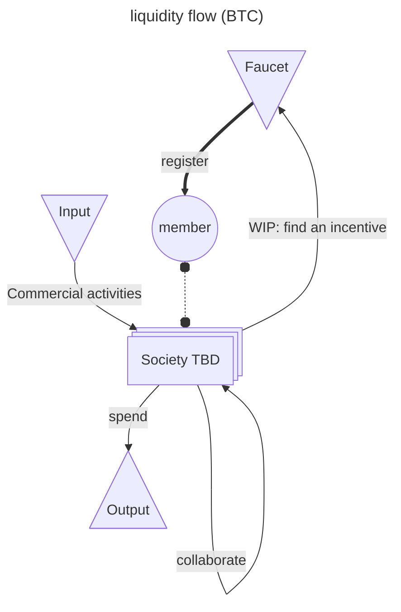

# Society TBD

### A new Society, To Be Defined *by you*.

- "Now, that’s the kind of government transparency that I’m here for" - A.
- "Love the concept!!" - C.
- "That's like a video game" - E.

## Demistifying and democratizing blockchain technology.

### For everyone, with no discrimination of skills or professional experience.

## Values / goal (TBD)

*Society TBD* is a non-profit organization aiming to create a decentralized only circular economy and innovate democratic governance.

> Whoever oppresses the poor to increase his own wealth, or gives to the rich, will only come to poverty. ~ Proverbs 22:16

> And whatever you do, do it heartily, as to the Lord and not to men ~ Colossians 3:23

## Members

| name | identifier | registration number | certificate |
|------|------------|---------------------|-------------|
| C. | [`bc1q3sqklhqpdwjnpthecn0pgeyatr4vf290ezxvq9`](https://mempool.space/address/bc1q3sqklhqpdwjnpthecn0pgeyatr4vf290ezxvq9) | [`98e077...1c84ac`](https://mempool.space/tx/98e07795a8ca6452088ba64c2de4802c2c16ee733b6718da5a8a436ed31c84ac) | in progress |
| A. | [`bc1q8em0mdcer84fy724awvvy9yegcart4r7gxf9yh`](https://mempool.space/address/bc1q8em0mdcer84fy724awvvy9yegcart4r7gxf9yh) | [`94c5bf...442515`](https://mempool.space/tx/94c5bf1f0373c0cc4924c454719ca0a89728697d160cca05fa79fc12e9442515) | pending |
| Lo. | [`bc1q3fk8jssft0928tzjktuefkp7k9r98g0q0ljd0m`](https://mempool.space/address/bc1q3fk8jssft0928tzjktuefkp7k9r98g0q0ljd0m) | [`06c749...c1b6cf`](https://mempool.space/tx/06c74924a411095ec6072f17005209daf05cf66eb87bce0d8c0c8201fac1b6cf) | to renew |
| Le. | [`bc1qd528shvfhls4k79z8ed385l7jz58ur90ufl9a7`](https://mempool.space/address/bc1qd528shvfhls4k79z8ed385l7jz58ur90ufl9a7) | [`af855f...97153f`](https://mempool.space/tx/af855f8dcaad737e05365733b89995c7ffd6ab75f46021ff2b4f5b318297153f) | to renew |
| E. | in progress | in progress | none

Certificate issuer: tbdsociety.eth

## Membership registration policy

First of all, if you have received your first registration transaction, we thank you from the bottom of our heart for participating in the broader adoption of [open source software](https://en.wikipedia.org/wiki/Open_source) and [peer to peer](https://en.wikipedia.org/wiki/Peer-to-peer) network for a better common world ❤️

Although we highly recommend you to hold or keep your registration donation into the ecosystem, the Society TBD and any of their member is not and will never be entitled to ask you back the funds or any other kind of financial compensation. Consider it a gift from God.

## Privacy policy

Society TBD will never share publicly your private information unless a formal and written agreement is signed and sent from you.

# [draft] trustless based economy

