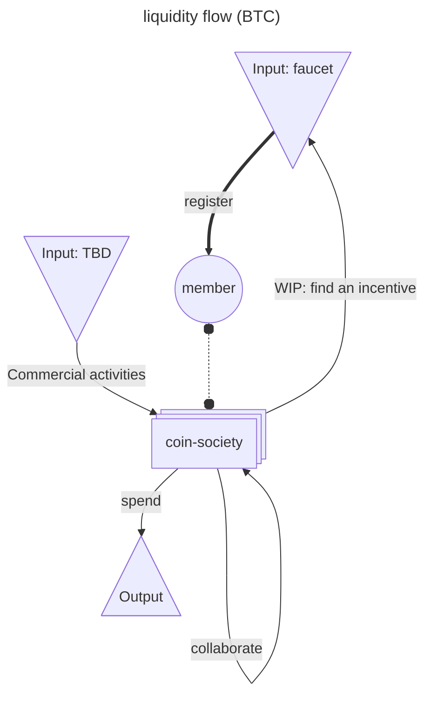

# coin society contributors

[Website](coin-society.org) | [Sources](./website/)

> And whatever you do, do it heartily, as to the Lord and not to men ~ Colossians 3:23

> Whoever oppresses the poor to increase his own wealth, or gives to the rich, will only come to poverty. ~ Proverbs 22:16

## Use case example

> We just split a bill using bitcoin, the future is here - Agustin

One member offered to pay the meal by card and equalize with Bitcoin:
- [4ffbc83a21de130c86338f6234db07bad76d6f642dad64a70f0436038fe27e95](https://mempool.space/tx/4ffbc83a21de130c86338f6234db07bad76d6f642dad64a70f0436038fe27e95)
- [681d42aa2f625f5797eaa681a73f1758081053a47c23fd5a207009101a97b850](https://mempool.space/tx/681d42aa2f625f5797eaa681a73f1758081053a47c23fd5a207009101a97b850)

## Membership registration policy

First of all, if you have received your first registration transaction, we thank you from the bottom of our heart for participating in the broader adoption of [open source software](https://en.wikipedia.org/wiki/Open_source) and [peer to peer](https://en.wikipedia.org/wiki/Peer-to-peer) network for a better common world ❤️

Although we highly recommend you to hold or keep your registration donation into the ecosystem, the coin-society and any of their member is not and will never be entitled to ask you back the funds or any other kind of financial compensation. Consider it a gift from God.

## Tokenonomics

