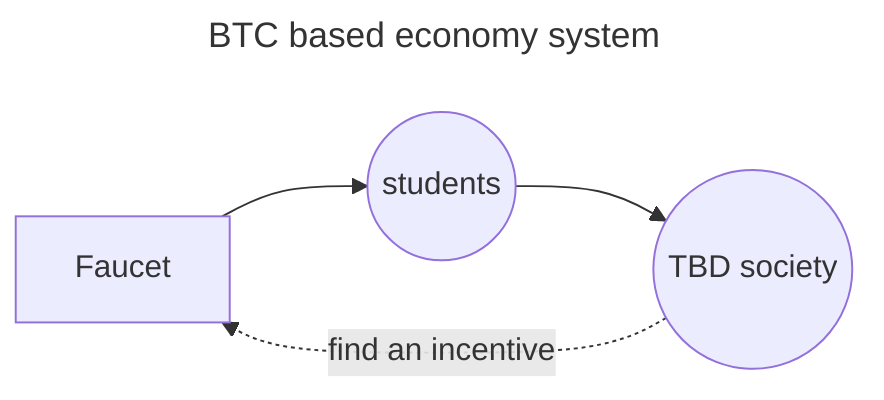

# TBD society

## Demistifying and democratizing blockchain technology.

### For everyone, with no discrimination of skills or professional experience.

## Our values / goal

This is a social experiment in the attempt to create an on-chain circulare economy with a democratic governance.

> Whoever oppresses the poor to increase his own wealth, or gives to the rich, will only come to poverty. ~ Proverbs 22:16

> And whatever you do, do it heartily, as to the Lord and not to men ~ Colossians 3:23

## Certified members

| name | identifier | registration number | certificate |
|------|------------|---------------------|-------------|
| C. | [`bc1q3sqklhqpdwjnpthecn0pgeyatr4vf290ezxvq9`](https://mempool.space/address/bc1q3sqklhqpdwjnpthecn0pgeyatr4vf290ezxvq9) | [`98e077...1c84ac`](https://mempool.space/tx/98e07795a8ca6452088ba64c2de4802c2c16ee733b6718da5a8a436ed31c84ac) | in progress |
| A. | [`bc1q8em0mdcer84fy724awvvy9yegcart4r7gxf9yh`](https://mempool.space/address/bc1q8em0mdcer84fy724awvvy9yegcart4r7gxf9yh) | [`94c5bf...442515`](https://mempool.space/tx/94c5bf1f0373c0cc4924c454719ca0a89728697d160cca05fa79fc12e9442515) | pending |
| Lo. | [`bc1q3fk8jssft0928tzjktuefkp7k9r98g0q0ljd0m`](https://mempool.space/address/bc1q3fk8jssft0928tzjktuefkp7k9r98g0q0ljd0m) | [`06c749...ac1b6cf`](https://mempool.space/tx/06c74924a411095ec6072f17005209daf05cf66eb87bce0d8c0c8201fac1b6cf) | to renew |
| Le. | [`bc1qd528shvfhls4k79z8ed385l7jz58ur90ufl9a7`](https://mempool.space/address/bc1qd528shvfhls4k79z8ed385l7jz58ur90ufl9a7) | [`af855f...97153f`](https://mempool.space/tx/af855f8dcaad737e05365733b89995c7ffd6ab75f46021ff2b4f5b318297153f) | to renew |

## Privacy policy

TBD society will never share publicly your private information unless a formal and written agreement is signed and sent from you.

# draft idea (WIP)

