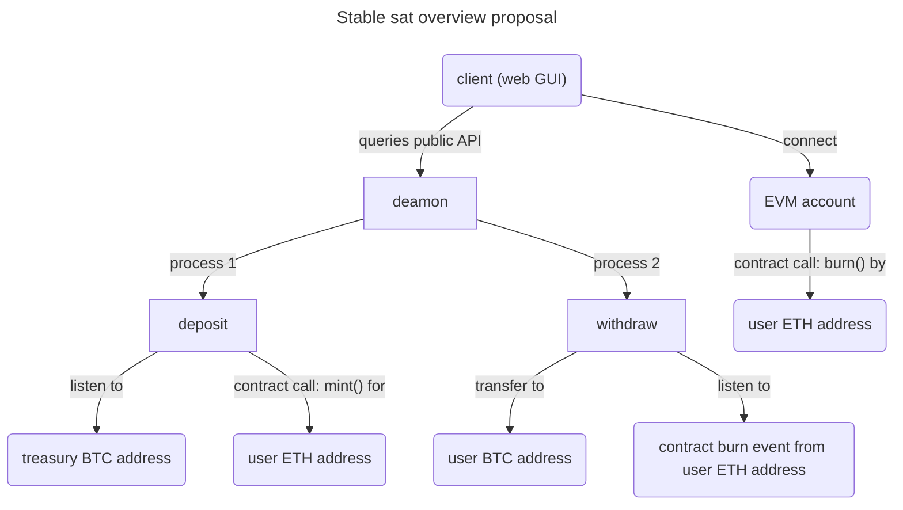

# [coin-society.eth](https://coin-society.org) - Stable Sat

[Home](/) | [Website](/website/) | [Certification](/certification/) | [**Stable Sat**](/stable-sat/) | [Contributing](/CONTRIBUTING.md)

